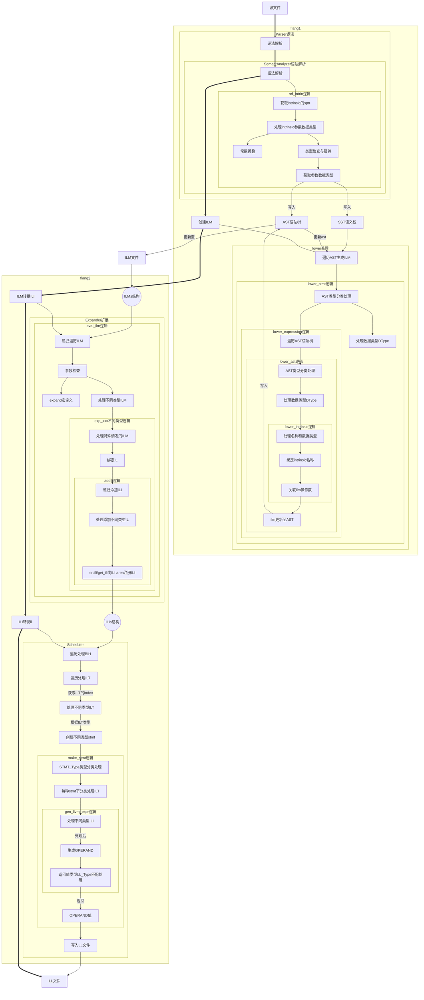

[TOC]
# 一、特性说明
本特性为按位比较，有四个intrinsic内置函数，分别是bge,bgt,ble,blt。

按位比较的要求：
- 参数个数为2，参数类型可以为integer，或者boz位序列；返回值为logical类型；
- 按照位序列的比较方式，从左到右，按位依次进行比较，比较位为1的参数，大于比较位为0的参数，所有位都相等，则两参数相等；
- 当参数类型不相同时，需要将长度较短的参数，按照左边补0的方式，扩展至与较长参数长度相等后，再进行比较。

# 二、内置函数的flang流程说明
## 2.1 AST的生成
flang1经过词法分析和语法信息，生成AST抽象语法树，在flang1的parser中，将进行词法语法分析，针对intrinsic函数，最终调用ref_intrin接口。

整个过程中将不断操作SST和AST结构，将解析的必要信息存放到内存中。对SST和AST的操作，请参考flang1/semant.html文档，和flang1/ast.html文档。
### 2.1.1 ref_intrin接口
该接口中有如下操作（不仅限于）：
- 对intrinsic的参数等进行处理，并做必要的常量折叠，如不能进行常量折叠，则将解析到的参数信息，如类型等，存入SST和AST中。
- 生成intrinsic的ast节点node，将参数类型信息、函数类型信息(I_BGE)等更新至该节点node，并将该节点存放到SST中。

## 2.2 AST转换ILM
flang1通过lower流程，对AST中的语法进行转换，关联ILM的操作码和操作数。

该过程将通过接口ast_trav_recurse递归存放在AST中的操作码和操作数，对AST整个抽象语法树进行遍历处理。在接口lower_ast中，根据ast类型(A_INTR)的不同，将对不同的语法表达式执行不同lower操作。

对于intrinsic内置函数来说，在lower_ast中，将有至少两种操作
1. 对intrinsic本身的操作，类型为A_INTR，执行lower_intrinsic处理接口
2. 对参数的操作，如果参数类型为变量，且形参与实参类型不同，则类型被处理未A_CONV，此时将执行类型强转操作。

### 2.2.1 lower_intrinsic接口
该接口有如下操作（不仅限于）：
- 将ilm与参数绑定
- intrinsic函数名称操作符与ilm绑定，同时绑定对参数列表的操作选项(如in_il_K)

## 2.3 ILM转换ILI
flang2通过expand流程，对ILMs中的ilm进行转换，生成并添加相关联的ILI。

该过程将通过对ilm输出的处理，生成ILMs结构（参考flang2/ilm.html），并将ILMs结构转换成ILIs结构（参考flang2/ili.html），进而通过对ILIs的处理，生成ll。

该过程将通过接口eval_ilm遍历ILMs，并根据IM类型的不同，进行不过的操作处理，当操作符为specific name时，会调用接口exp_mac来对当前的ilm索引进行expand处理，生成新的ILI后，通过调用addili添加到ILIs中。

在addili例程中，根据当前ILI的类型（参考flang2/ili.html），进行不同的操作处理。
### 2.3.1 addarth
该接口有如下操作（不仅限于）：
- 根据ILI不同，做不同方式的ILI添加处理
- 可通过处理操作码和操作数的ILI，实现相关功能

## 2.4 ILI转换LL
flang2通过scheduler，对ILIs中的ILI进行处理，转换成llvm的表达式。

# 三、特性添加说明
## 3.1 添加定义
- `symini_ftn.n`：定义specific，generic，predeclare等；
    - `./tools/flang1/utils/symtab/symini_ftn.n`
- `ilmtp.n`：定义ilm
    - `./tools/flang2/utils/ilmtp/x86_64/ilmtp.n`
- `ilitp.n`：定义ILI
    - `./tools/flang2/utils/ilitp/x86_64/ilitp.n`
- `upperilm.in`：定义ilm操作，使得解析ilm时可以识别新增操作
    - `./tools/flang2/utils/upper/upperilm.in`

## 3.2 特性解析记录
## 3.2.1 flang1部分
1. ref_intrin中，在解析参数类型时，根据ast类型类型，对当前intrinsic的参数进行处理
- 如果当前参数是常量，则处理成32位整型；
- 如果当前参数是标识符（变量），则对其进行正常类型检查与类型强转
2. lower_intrinsic中，
- 在处理参数列表之前，对参数列表进行补0操作
- 绑定ilm，以及参数列表的处理选项

## 3.2.2 flang2部分
1. addarth中，根据il类型，以不同的方式添加ILI

## 3.3 padding
1. 当是形参均为变量，且kind类别不同时，处理AST语法树中的A_CONV强转，将强转操作的操作数类型作为源数据类型，将强转的返回数据类型，作为目的数据类型，使用ULSHIFT和URSHIFT进行左侧补0操作
2. 当形参存在一个常量时，将该常量参数作为integer(4)处理，将其他较短变量，通过左侧补0方式，转换为integer(4)

# 四、intrinsic流程图
内置函数处理流程说明（==仅供参考！！！==）：

